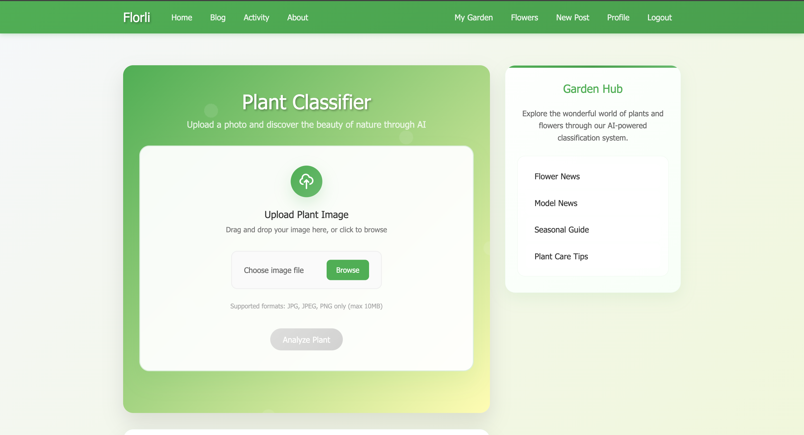
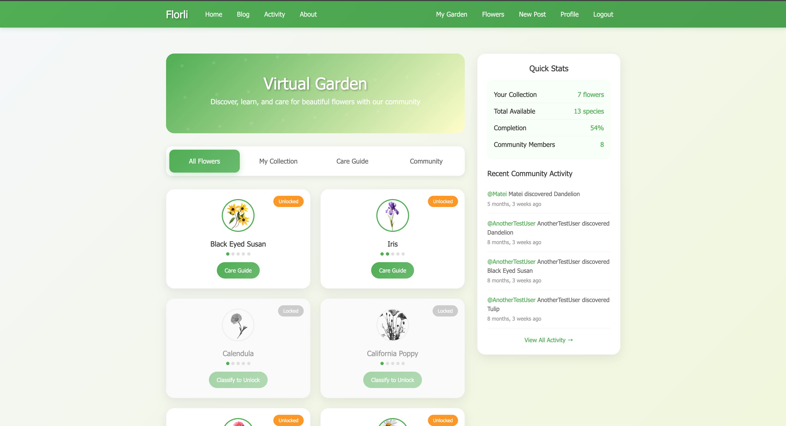
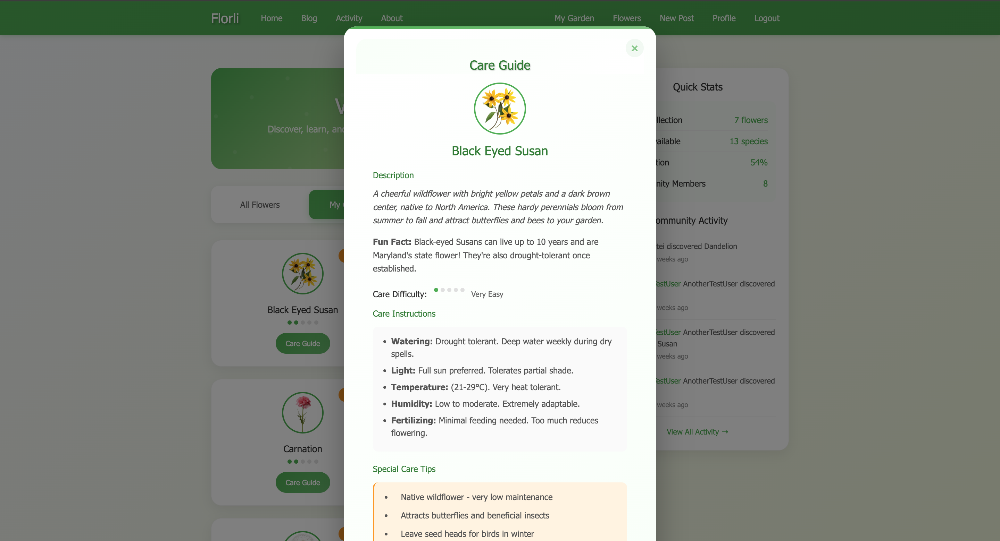
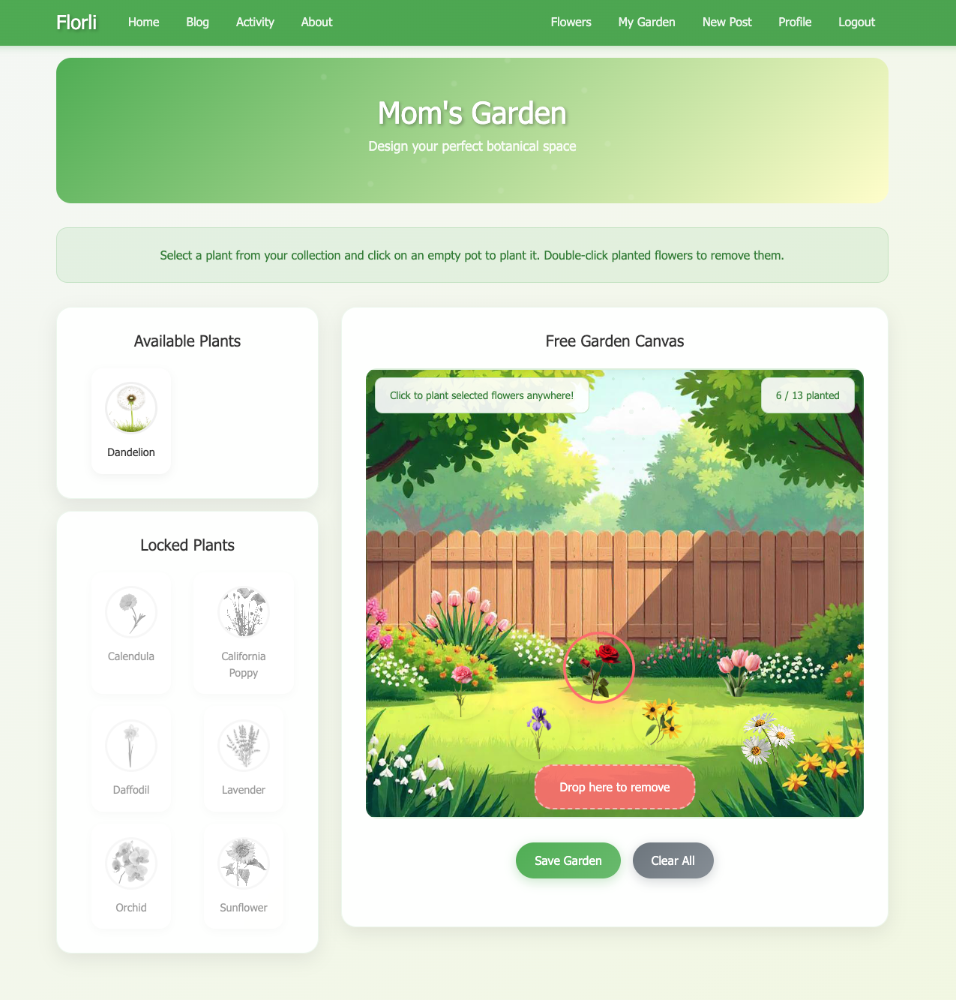
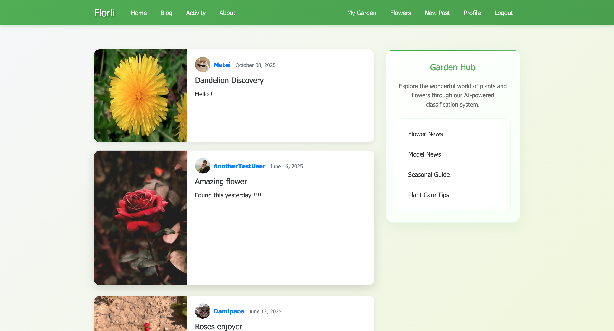

<div align="center">

# Florli

### AI-Powered Flower Classification & Virtual Gardening Platform

*Discover · Classify · Grow · Share*

[](https://python.org)
[](https://djangoproject.com)
[](https://tensorflow.org)
[](https://docker.com)
[](https://postgresql.org)

[Watch Demo](https://drive.google.com/file/d/1omF0-kEJ_ijb0E_mwGIQ64045EkiNZdr/view?usp=sharing) · [ML Documentation](https://drive.google.com/file/d/1qFReySq6UCtSBxrwk3ZkUZAWFWLYdzqn/view?usp=sharing) · [Bachelor's Thesis — UAIC Iași, 2025](#)

</div>

---

## What is Florli?

Florli is a full-stack web platform built as a Bachelor's Thesis at the Faculty of Computer Science, Alexandru Ioan Cuza University of Iași. It combines a fine-tuned deep learning model for flower classification with a social, gamified experience: users photograph flowers, unlock them in their collection, grow a virtual garden, and share discoveries with the community.

The project covers the full lifecycle of an ML-powered product: **data preparation → model training → Django integration → user experience → containerized deployment**.

---

## Feature Walkthrough

### Authentication & User Profiles
- Full registration and login system with Django's authentication framework
- Each user has a public profile page
- From any blog post, other users can navigate to the author's profile and **view their virtual garden**

### AI Flower Classification
- Upload a photo of a flower and receive an instant prediction with a **confidence score**
- Powered by a fine-tuned **EfficientNetB2** model trained via transfer learning on a custom multi-class dataset
- Supports **13 flower species** (see full list below)
- Achieves **96% classification accuracy** on the test set
- On successful classification, the flower is automatically **unlocked** in the user's collection

### AI Classification Home


### Flower Collection & Care Guides
- Each unlocked flower is added to the user's personal **Flowers** page
- Detailed **Care Guides** for each species including difficulty rating, watering needs, and growing tips
- Gamification elements:
  - **Achievements** based on collection completion percentage
  - **Your Collection** overview showing unlocked vs. remaining species
  - **Total Members** who have unlocked the same species
  - **Activity Feed** — a live log showing *"User X unlocked species Y"* events across the platform

### Flower Collection


### Flower Care Guides


### Virtual Garden
- Interactive **drag-and-drop garden canvas** where users arrange their unlocked flowers
- Each flower occupies a slot in a visual garden grid
- The garden layout is **persisted per user** and visible on their public profile
- Other users can visit your profile and see your garden exactly as you arranged it

### Drag-n-drop Garden


### Community Blog
- After unlocking a flower, users can **share their discovery** with a blog post
- Full **CRUD** on posts: create, edit, delete, view
- Posts are visible to all users and tied to the author's profile
- Encourages knowledge sharing: care tips, growth stories, photography

### Blog


---

## ML Module — EfficientNetB2 Classifier

| Detail | Value |
|---|---|
| Base architecture | EfficientNetB2 (ImageNet pre-trained) |
| Approach | Transfer learning with fine-tuning |
| Classes | 13 flower species |
| Test accuracy | **96%** |
| Input size | 224×224 RGB |
| Framework | TensorFlow / Keras |
| Integration | Embedded in Django view, runs on image upload |

**Supported species:** Astilbe · Bellflower · Black-eyed Susan · Calendula · California Poppy · Carnation · Common Daisy · Coreopsis · Dandelion · Iris · Rose · Sunflower · Tulip

Full training methodology, dataset details, and evaluation metrics available in the [ML Module Documentation](https://drive.google.com/file/d/1qFReySq6UCtSBxrwk3ZkUZAWFWLYdzqn/view?usp=sharing).

---

## Technology Stack

| Layer | Technology |
|---|---|
| Backend | Django 4, Python 3.10+ |
| Frontend | HTML5, CSS3, JavaScript, Bootstrap 4 |
| AI / ML | TensorFlow 2.x, Keras, EfficientNetB2 |
| Database | PostgreSQL 15 (via Docker), SQLite (local dev fallback) |
| Image Processing | Pillow |
| Containerization | Docker, Docker Compose |
| Environment Config | python-decouple, `.env` files |
| Version Control | Git, GitHub |

---

## Running with Docker (Recommended)

The entire stack — Django app + PostgreSQL database — runs with a single command.

**Prerequisites:** Docker and Docker Compose installed.

```bash
# 1. Clone the repository
git clone https://github.com/BejenaruIoanMatei/florli.git
cd florli

# 2. Create your environment file
cp .env.example .env
# Edit .env with your preferred values

# 3. Start all services
docker compose up --build

# 4. Open in browser
# http://localhost:8000
```

OBS: 

-   You won't be able to run it fully because the model is obtained after running the jupyter notebook script, static files are not uploaded to github, etc. The app won't start.

---

## Local Development (Without Docker)

```bash
# 1. Create and activate virtual environment
python -m venv venv
source venv/bin/activate  # Windows: venv\Scripts\activate

# 2. Install dependencies
pip install -r requirements.txt

# 3. Set up environment variables
cp .env.example .env

# 4. Run migrations
cd licenta_project
python manage.py makemigrations
python manage.py migrate

# 5. Start development server
python manage.py runserver
```

---

## Project Structure

```
florli/
├── licenta_project/
│   ├── blog/                  # Core app: classification, posts, activity feed, care guides
│   │   └── ml_model/          # EfficientNetB2 model weights + inference logic
|   ├── classifier             # Model Notebook and class labels used in blog/keras_utils
│   ├── virtual_garden/        # Drag-and-drop garden, layout persistence
│   ├── users/                 # Auth, registration, public profiles
│   └── licenta_project/       # Django settings, URLs, WSGI
├── docker-compose.yml         # Multi-container setup (web + db)
├── Dockerfile
├── .env.example               # Environment variable template
├── requirements.txt
└── README.md
```

---

## Architecture Overview

```
User uploads image
        │
        ▼
Django View (blog/)
        │
        ▼
EfficientNetB2 Inference  ──→  Confidence Score + Predicted Species
        │
        ▼
Flower unlocked in DB  ──→  Activity Feed updated
        │
        ├──→  User's Collection (Flowers page)
        ├──→  Care Guide available
        └──→  Virtual Garden (drag & drop placement)
                    │
                    └──→  Visible on public profile
```

---

<div align="center">

*Developed as a Bachelor's Degree Thesis — Faculty of Computer Science, Alexandru Ioan Cuza University of Iași, 2025*

</div>